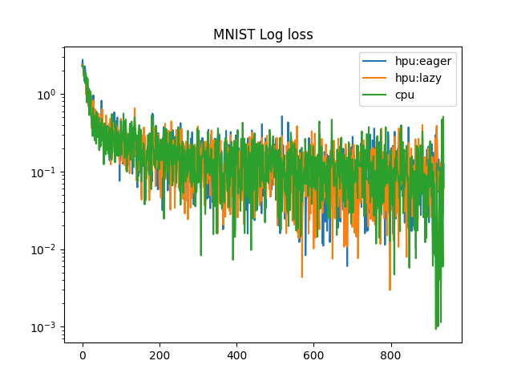
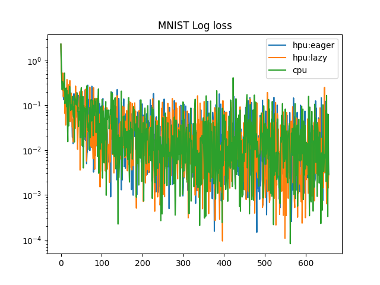

# MNIST sample to study loss curves Eager (torch.compile) vs Lazy modes

MNIST sample is taken from [Model References](https://github.com/HabanaAI/Model-References/blob/master/PyTorch/examples/gpu_migration/simple_examples/mnist/main.py) to study log loss curves across cpu, hpu (lazy and eager modes). Changes made include:
- Support for CPU execution
- Seed for random number generation
- Saving loss per run in pkl files

## Prequisites

```
pip install -r requirements.txt
```

## CPU
```
python3 mnist_sample.py
```
```
Test set: Average loss: 0.0254, Accuracy: 9923/10000 (99%)
```

## HPU:Lazy
```
PT_HPU_GPU_MIGRATION=1 PT_HPU_LAZY_MODE=1 python3 mnist_sample.py
```
```
Test set: Average loss: 0.0270, Accuracy: 9917/10000 (99%)
```

## HPU:Eager/Torch compile
```
PT_HPU_GPU_MIGRATION=1 PT_HPU_LAZY_MODE=0 python3 mnist_sample.py --use-torch-compile
```
```
Test set: Average loss: 0.0270, Accuracy: 9917/10000 (99%)
```

The `plot_curves.py` script loads losses captured over every step and epoch in `.pkl` files and generates a graph.

## Single epoch Log loss Plot




## Log loss Plot

Plot across all epochs with 20 step interval

