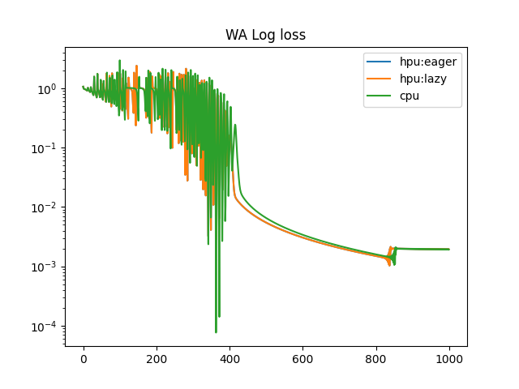

# Analyzing loss curves Eager + torch compile vs Lazy modes

This page outlines the efforts to debug the difference in loss graph for lazy mode and eager mode as shown below:


Lazy curves lag behind the eager + torch compile one.

## Pre-requisites

Start docker container (assuming OneCloud environment) as shown.
```
bash pt_docker.sh
```

Note: To be current, we use `1.20` docker here but issue was debugged on earlier versions originally.

The rest of the commands are to be carried out inside the docker.

```
pip install -r requirements.txt
```

## Reproduce the issue

The script `SAM.py` is the code implementing Sharpness Aware Minimization per [Github link](https://github.com/davda54/sam).

The `run.sh` executes the `customer_reproducer.py` script in all three - cpu, eager+torch.compile, lazy modes and invokes `plot_curves.py` to plot correspondong loass graphs.

> Note: One can optionally set `export SUFFIX=<test name>` to generate unique plots for each experimental case

```
cd eager_vs_lazy_loss/
bash run.sh
```

If you didn't provide a SUFFIX, You will see three pickle files generated like so: `verify_cpu_.pkl`, `verify_eager_.pkl` and `verify_lazy_.pkl` and a plot generated named `_loss_curve.png`.
The plot should resemble the one shown in the first section of this page.

## Generating Graph visualization

Per [Gaudi documentation](https://docs.habana.ai/en/latest/PyTorch/Reference/Debugging_Guide/Debugging_Slow_Convergence.html), we re-run by enabling the environment variable for graph visualization and re-run just lazy and torch compile modes.
But since by default 1000 epochs are run, first modify to a smaller number in `customer_reproducer.py`. This is mainly needed for eager + torch compile which generate a lot of *.pbtxt files outside of .graph_dumps directory.
```
num_epoch=2
```

Run the lazy mode with graph visualization and rename the directory (default is .graph_dumps) so we can easily associate the modes with generated files.
```
GRAPH_VISUALIZATION=1 DEVICE="hpu" PT_HPU_LAZY_MODE=1 python3 customer_reproducer.py
mv .graph_dumps lazy_graph_dumps
```

Run eager mode similarly
```
GRAPH_VISUALIZATION=1 DEVICE="hpu" PT_HPU_LAZY_MODE=0 python3 customer_reproducer.py
mv .graph_dumps eager_graph_dumps
```

After this you should see files generated like so:


> Note: The permissions of the generated .graph_dumps directory can be root only so be sure to open up permissions with `chmod -R 777 <dir name>` to view files outside container.

## Analysing Graph Visualization

One way is to navigate to `https://netron.app/` in the browser and upload the generated files. Alternatively you can use VSCode netron extension but I have found that to be much slower for some reason.

### Pre Graphs

Pre graphs are generated by operation backends prior to compilation and post graphs are generated by graph compiler.
In lazy mode linear operations invoke linear op backend but in eager linear operations are decomposed further.

| Lazy pre graph | Eager* pre graph | Eager*+PT_HPU_OVERRIDE_LINEAR_MATMUL_EAGER |
|----------------------------|------------------------------| -------------------------------------------------------- |
| |   |  |


> *Eager + torch compile

We re-run eager with `PT_HPU_OVERRIDE_LINEAR_MATMUL_EAGER=true`, that helps us to run linear without decomposition per [scripts/env_flags.yaml](https://github.com/habana-internal/pytorch-integration/blob/master_next/scripts/env_flags.yaml#L817-L820) 
```
PT_HPU_OVERRIDE_LINEAR_MATMUL_EAGER:
  type: bool
  default: false
  doc: "This flag overrides aten.linear and aten.matmul decompositions in eager and torch.compile."
```

```
PT_HPU_OVERRIDE_LINEAR_MATMUL_EAGER=true GRAPH_VISUALIZATION=1 DEVICE="hpu" PT_HPU_LAZY_MODE=0 python3 customer_reproducer.py
mv .graph_dumps eager_override_linear_graph_dumps
```

Please note that the post graphs with plain torch compile and torch compile with PT_HPU_OVERRIDE_LINEAR_MATMUL_EAGER=true  remain same

 Eager + torch compile mode post graph | with PT_HPU_OVERRIDE_LINEAR_MATMUL_EAGER|
-----------------------------| -------------------------------------------------------- |
|   |  |


### Pre Graphs - Forward Pass

> Forward graphs were designated as such based on presence of "fwd" functions in graph

Now to compare forward pass pre graphs first,

| Lazy | Eager + torch.compile+ override |
|------|-------|
| | 


### Pre Graphs - Backward Pass

> Backward graphs were designated as such based on presence of "bwd" functions in graph

| Lazy | Eager + torch.compile+ override |
|------|-------|
| | 


`tanh_bwd` is present in only Lazy graph and not eager + torch.compile and was suspected.

### Lazy mode - why so many graphs

One thing of note is Lazy mode generates way more graphs than eager.
Each one of the four additional graphs corresponds to `mark_step()`, as an experiment, one can remove those and get same number of graphs for lazy and eager as shown:

Code changes:

```python
for epoch in pbar:
    optimizer.zero_grad()
    out = model(X)
    loss = loss_func(out, y)
    loss_list.append(loss.item())
    pbar.set_postfix({'loss': loss.item()})
    detached_state_dict = {}
    for name, param in model.state_dict().items():
        detached_state_dict[name] = param.detach().cpu().numpy()
    state_dict_list.append(detached_state_dict)
    loss.backward()
    #if os.getenv('PT_HPU_LAZY_MODE') == '1':
    #    htcore.mark_step()

    optimizer.first_step(zero_grad=True) # First Step
    #if os.getenv('PT_HPU_LAZY_MODE') == '1':
    #    htcore.mark_step()

    second_loss = loss_func(model(X), y)
    second_loss.backward()
    #if os.getenv('PT_HPU_LAZY_MODE') == '1':
    #    htcore.mark_step()
    optimizer.second_step(zero_grad=True) # Second Step
    #if os.getenv('PT_HPU_LAZY_MODE') == '1':
    #    htcore.mark_step()
```

Generated graphs see directory ./graph_dumps/lazy_no_mark_steps

#### Consolidated forward pass- lazy


#### Consolidated backward pass - lazy


## Verifying tanh backward workaround

As tanh backward was suspected, we replace existing implementation to handle tanh implementation in a custom manner like so

 

The assumption being current TPC implementaion for tanh backward in lazy mode is not accurate.
The script `customer_reproducer_with_wa.py` has the necessary changes. You can replace `customer_reproducer` with `customer_reproducer_wa` in `run.sh` or run the commands below:

```
cd eager_vs_lazy_loss/
export SUFFIX="WA"
python3 customer_reproducer_wa.py
DEVICE="hpu" PT_HPU_LAZY_MODE=1 python3 customer_reproducer_wa.py
DEVICE="hpu" PT_HPU_LAZY_MODE=0 python3 customer_reproducer_wa.py
python3 plot_curves.py

```

Below you can see the aligned loss curve with the workaround:



## TPC Kernels Build

Follow [link](https://wiki.ith.intel.com/pages/viewpage.action?spaceKey=CE4AI&title=PT+Bridge+-+Foundation+Build+and+Debug) to initiate a build.

### Code changes
Following changes were done:
1. Change to fail at first error added to `tpc_kernels/CMakeLists.txt`
```diff
diff --git a/CMakeLists.txt b/CMakeLists.txt
index f86df17ed..857673feb 100644
--- a/CMakeLists.txt
+++ b/CMakeLists.txt
@@ -14,6 +14,7 @@ project(tpc_kernels)

 # Reduce "warm" compilation time if ccache is available
 find_program(CCACHE_PROGRAM ccache)
+add_definitions("-Wfatal-errors")
```
2. Change for "missing file" errors added to `tpc_kernels/tests/tests_core/CMakeLists.txt`
```diff
diff --git a/tests/tests_core/CMakeLists.txt b/tests/tests_core/CMakeLists.txt
index 278452476..3b12681bf 100644
--- a/tests/tests_core/CMakeLists.txt
+++ b/tests/tests_core/CMakeLists.txt
@@ -58,7 +58,9 @@ target_compile_options(${TARGET_EXT} PRIVATE
     -DTESTS_CORE_EXTERNAL=1)

 include_directories(/usr/include/drm /usr/include/libdrm)
-
+include_directories($ENV{HABANA_SOFTWARE_STACK}/func-sim/agents/tpc/src
+                    $ENV{HABANA_SOFTWARE_STACK}/func-sim/agents/tpc/numerics)
+include_directories($ENV{HABANA_SOFTWARE_STACK}/coral-sim/coral_user/arcbp/)
```

### Build commands

Get environment setup as before
```bash
source $HOME/trees/npu-stack/automation/habana_scripts/habana_env
source $HABANA_SOFTWARE_STACK/automation/habana_scripts/habana_functions.sh
cd trees/npu-stack/
source venv/bin/activate
```

For error `make[2]: *** No rule to make target '/home/vgalli/builds/tpcsim_debug_build/libtpcsim_shared.so', needed by 'tests/tests_core/libtpc_tests_core.so'.  Stop.`
```
build_tpcsim -a -c -j 8
```

```
build_tpc_kernels -a -c -j 8
```
## Further Details

Mac/Fused Multipy Add(FMA) is described as an operation that modifies an accumulator like so `a: a ← a + ( b × c )`
When done with floating-point numbers, it might be performed with two roundings, or with a single rounding. When performed with a single rounding, it is called a fused multiply–add (FMA) or fused multiply–accumulate (FMAC).
In [hpu_ops.yaml](https://github.com/habana-internal/pytorch-integration/blob/master_next/scripts/hpu_op.yaml#L6391-L6398)
```
tanh_backward.grad_input:
  guid: tanh_bwd
  op_validator: check-node-with-shared-layer

tanh_backward:
  guid: tanh_bwd
  out_ids: [0]
  op_validator: check-node-with-shared-layer
```

- In lazy mode, FMA is used for tanh backward per in `tpc_kernels/kernels/gaudi/elementwise/special/tanh_bwd.h` [see TPC kernel link](https://github.com/habana-internal/tpc_kernels/blob/master_next/kernels/gaudi/elementwise/special/tanh_bwd.h#L83-L86)
  ```
  // grad * ( 1 - tanh * tanh )
  // => grad - grad * tanh * tanh
  inter_res   = v_mul_v_v(tanh_values, tanh_values);
  output_grad = v_mac_v_v(input_grad, inter_res, input_grad, SW_NEG);
  ```
  Since this code is in the `kernels` directory, gdb cannot reach it via a breakpoint (only files under `src` can have breakpoints), we can test this code is hit in lazy mode by adding the following lines of code:
  ```
  # Enables printf for tpc code
  #pragma tpc_printf (enable)
  void main(tensor grad_tnsr, tensor tanh_tnsr, tensor output_grad_tnsr)
  {
    # Prints out every time we do a tanh backward
    printf("main() About to compute tanh backward in lazy mode!!");
    const int5 indexSpaceStart = get_index_space_offset();
  ```
  Build tpc_kernels again as mentioned in previous section and copy over `trees/npu-stack/tpc-kernels/src/libtpc_kernels.so`  to `/usr/lib/habanalibs` (obtained from $LD_LIBRARY_PATH) and run the command for lazy mode. You will see the output printed as the progress bar proceeds.
- In eager mode, pytorch libs is decomposing tanh_bwd into elementwise operations. In such as case, the underlying kernels for elementwise ops will not use MAC. Code supporting this at [pytorch-integration link](https://github.com/habana-internal/pytorch-integration/blob/master_next/python_packages/habana_frameworks/torch/dynamo/compile_backend/decomposition.py#L227-L228) shown below succinctly:

  ```python
    from torch._decomp import core_aten_decompositions, get_decompositions
    # List of built-in pytorch framework decompositions we would like to use in HPU
    # backend in both training and inference.
    hpu_backend_decompositions_list = [
      ..
      aten.tanh_backward.default,
      aten.tanh_backward.grad_input,
      ..
    ]
    hpu_backend_decompositions_common = get_decompositions(hpu_backend_decompositions_list)
  ```
  This maps to Pytorch decomposition at [torch/_decomp/decompositions.py](https://github.com/pytorch/pytorch/blob/main/torch/_decomp/decompositions.py#L113-L117)
  ```python
  @register_decomposition(aten.tanh_backward)
  @out_wrapper("grad_input")
  @pw_cast_for_opmath
  def tanh_backward(out_grad: Tensor, y: Tensor):
    return out_grad * (1 - y * y).conj_physical()
  ```

See [ticket comment](https://habana.atlassian.net/browse/HS-3930?focusedCommentId=66590) for explanation.

## Acknowledgement

For debug, SW side assistance, all credit to Pralay Das (pralay.das@intel.com)

## Opens
- Code corresponding to lazy and eager tanh backward implementations(addressed)
- Why does lazy use MAC but not eager?

## References

- https://pytorch.org
- [JIRA](https://habana.atlassian.net/browse/HS-3930)
- https://github.com/habana-internal/pytorch-integration/blob/master_next/scripts/README_hpu_op.md
- https://en.wikipedia.org/wiki/Multiply%E2%80%93accumulate_operation
- [tpc_mlir](https://github.com/habana-internal/tpc_mlir/blob/master_next/mlir/habana/lib/Dialect/Synapse/IR/SynapseCanonicalization.td#L24)
