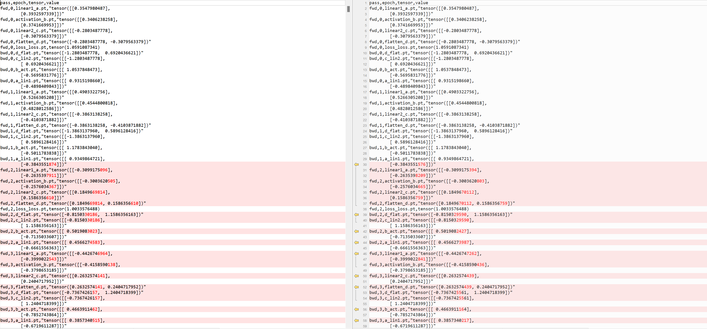
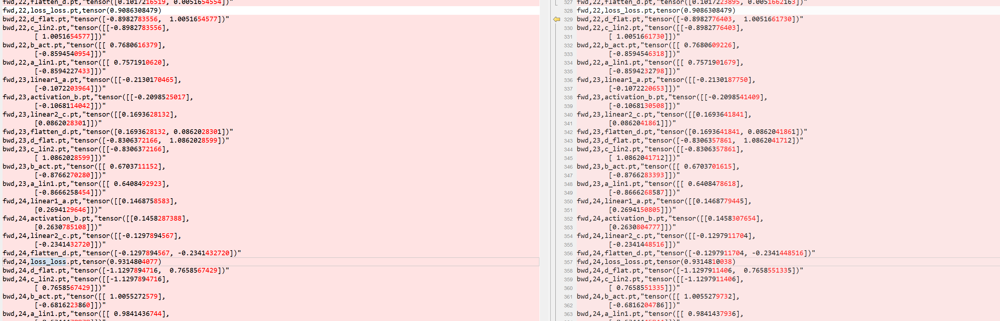

## Unit Test with tanh backward

If one runs with `standalone_test.py`

```
import torch
import torch.nn as nn
import habana_frameworks.torch.core as htcore
import os

class CustomTanh:
    def __init__(self, x):
        self.f = nn.Tanh()
        self.x = x
    def get_tanh(self, x):
        return self.f(x)
    def backward(self):
        y = self.f(x)
        return y.backward()
    
torch.set_printoptions(precision=16)
# Run on HPU
x = torch.tensor(0.3547980487346649, requires_grad=True).to("hpu") 
x.retain_grad()
c = CustomTanh(x)
if os.getenv("PT_HPU_LAZY_MODE", "1") == "0":
    # Needs to be a callable function
    c.get_tanh = torch.compile(c.get_tanh, backend="hpu_backend")
c.backward() 
print("x.grad(hpu):", c.x.grad.cpu()) 

# Repeat on CPU
x_cpu = torch.tensor(0.3547980487346649, requires_grad=True)
x_cpu.retain_grad()
f = nn.Tanh()
y_cpu = f(x_cpu)  
y_cpu.backward()   
print("x_cpu.grad(cpu):", x_cpu.grad.cpu()) 
```

- requires_grad: Is True if gradients need to be computed for this Tensor, False otherwise
- is_leaf: For Tensors that have requires_grad which is True, they will be leaf Tensors if they were created by the user. This means that they are not the result of an operation and so grad_fn is None.
- retain_grad: What .retain_grad() essentially does is convert any non-leaf tensor into a leaf tensor, such that it contains a .grad attribute (since by default, pytorch computes gradients to leaf tensors only). You can check for leaf tensor using <tensor>.is_leaf which is a boolean attribute.

> Note: the `torch.compile` mode is more elaborate given the function passed in needed to be callable and also we needed to be able to call `backward()`. There's possibly simpler ways to do this.


We see no difference between eager and lazy modes:

```
python3 standalone_test.py 
x.grad(hpu): tensor(0.8839753866195679)
x_cpu.grad(cpu): tensor(0.8839753866195679)
```
```
PT_HPU_LAZY_MODE=0 python3 standalone_test.py
x.grad(hpu): tensor(0.8839753866195679)
x_cpu.grad(cpu): tensor(0.8839753866195679)
```

But difference does exist when run for multiple epochs in the context of the model.


## Generate and study tensor dumps per stage

Per code changes in `customer_reproducer_debug.py`, dumped tensors and loss for fwd and backward passes.

```bash
> 
> grads = {}
> record_mode =  "lazy" if os.getenv("PT_HPU_LAZY_MODE","1") =="1" else "eager"
> bwd_epoch_counter=0
> torch.set_printoptions(precision=10)
> 
> 
> def dump_tensor(epoch, tensor, tensor_name, stage):
>     if not torch.is_tensor(tensor):
>         tensor = torch.as_tensor(tensor)
>         
>     cpu_tensor = tensor.to("cpu").detach()
>     if not os.path.exists(f"{record_mode}/fwd/{epoch}"):
>         os.makedirs(f"{record_mode}/fwd/{epoch}")
>     torch.save(cpu_tensor, f'{record_mode}/fwd/{epoch}/{stage}_{tensor_name}.pt')
30a46,55
> def store(grad, parent):
>     grads[parent] = grad.clone()
> 
> def dump_bwd_tensor(epoch):
>     if not os.path.exists(f"{record_mode}/bwd/{epoch}"):
>         os.makedirs(f"{record_mode}/bwd/{epoch}")
>     for k,v in grads.items():
>         v = v.to("cpu").detach()
>         torch.save(v, f'{record_mode}/bwd/{epoch}/{k}.pt')
> 
40a66
>         self.epoch_counter = 0
43,47c69,83
<         out1 = self.linear1(x)
<         out1 = self.activation(out1)
<         out2 = self.linear2(out1)
<         out2 = out2.flatten()
<         return out2
---
>         a = self.linear1(x)
>         a.register_hook(lambda grad:store(grad,'a_lin1'))
>         dump_tensor(self.epoch_counter, a, "a", "linear1")
>         b = self.activation(a)
>         b.register_hook(lambda grad:store(grad,'b_act'))
>         dump_tensor(self.epoch_counter, b, "b", "activation")
>         c = self.linear2(b)
>         c.register_hook(lambda grad:store(grad,'c_lin2'))
>         dump_tensor(self.epoch_counter, c, "c", "linear2")
>         d = c.flatten()
>         d.register_hook(lambda grad:store(grad,'d_flat'))
>         dump_tensor(self.epoch_counter, d, "d", "flatten")
>         self.epoch_counter+=1
> 
>         return d
58c94
< epoch_nums = 2
---
> epoch_nums = 200
78a115
>     dump_tensor(bwd_epoch_counter, loss.item(), "loss", "loss")
83a121,124
> 
>     dump_bwd_tensor(bwd_epoch_counter)
>     bwd_epoch_counter+=1
> 
92a134,136
>     dump_bwd_tensor(bwd_epoch_counter)
>     bwd_epoch_counter+=1
> 
```

Run the lazy and eager commands followed by command that creates csv from dumped tensors:

```
DEVICE="hpu" PT_HPU_LAZY_MODE=1 python3 customer_reproducer_debug.py
DEVICE="hpu" PT_HPU_LAZY_MODE=0 python3 customer_reproducer_debug.py
python3 tensor_csv_generator.py 
```

This generates two .csvs which can then be opened up in BeyondCompare.
Not super useful as loss doesnt begin to differ until 23/24 epoch but we already see differences in other tensors, so not very useful to determine where/when the issue is introduced.



